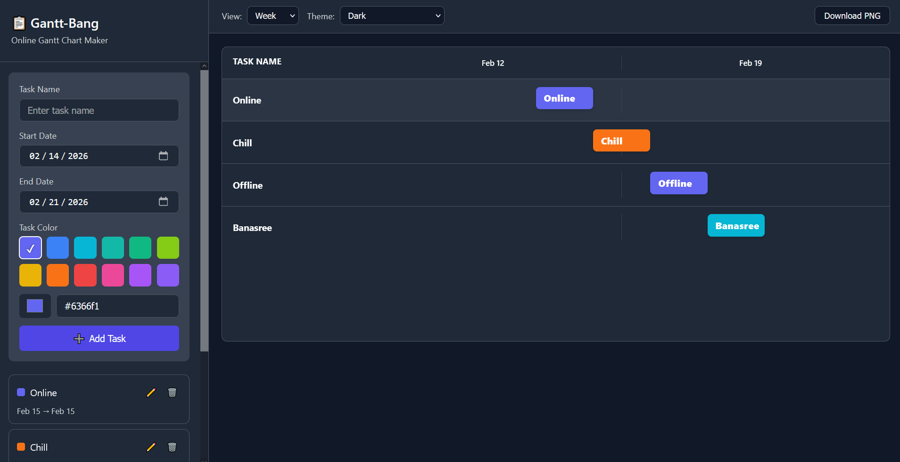

# 📋 Gantt-Bang

**Gantt-Bang** is a simple, modern online Gantt Chart maker. Built with pure HTML, CSS, and vanilla JavaScript.


🔗 **Live Demo:** [https://kazi-abdullah-al-hasnaine.github.io/Gantt-Bang-A_Gantt_Chart_Maker/](https://kazi-abdullah-al-hasnaine.github.io/Gantt-Bang-A_Gantt_Chart_Maker/)

---


<p align="center">
  
</p>
<p align="center">
  
</p>

## ✨ Features

- ✅ **Create & Edit Tasks** - Add, modify, and delete tasks
- ✅ **Drag to Move** - Drag task bars to change dates
- ✅ **Drag to Resize** - Resize tasks from edges
- ✅ **Timeline Views** - Day, Week, and Month views
- ✅ **12 Color Presets** - Professional colors ready to use
- ✅ **Custom Colors** - Pick any color you want
- ✅ **4 Themes** - Light, Dark, Minimal, Research
- ✅ **PNG Export** - Download high-quality images
- ✅ **Auto-Save** - Your data persists in browser
- ✅ **100% Offline** - Works without internet

---

## 🚀 Quick Start

### Use Online

Just visit: [https://kazi-abdullah-al-hasnaine.github.io/Gantt-Bang-A_Gantt_Chart_Maker/](https://kazi-abdullah-al-hasnaine.github.io/Gantt-Bang-A_Gantt_Chart_Maker/)

### Download and Use Locally

1. **Download the files:**
   ```bash
   git clone https://github.com/kazi-abdullah-al-hasnaine/Gantt-Bang-A_Gantt_Chart_Maker.git
   ```

2. **Open `index.html` in your browser**
   - Double-click the file
   - Or drag it into your browser

That's it! No installation needed.

---

## 📖 How to Use

### Adding Tasks

1. Enter task name
2. Select start and end dates
3. Pick a color (preset or custom)
4. Click "Add Task"

### Editing Tasks

- **Edit**: Click the ✏️ icon
- **Delete**: Click the 🗑️ icon
- **Move**: Drag the task bar
- **Resize**: Drag the left or right edge

### Changing Views

- **View dropdown**: Switch between Day, Week, Month
- **Theme dropdown**: Switch between 4 themes

### Exporting

- Click **"Download PNG"** button
- High-quality image downloads automatically
- White background for clarity

---

## 📁 Project Structure

```
Gantt-Bang-A_Gantt_Chart_Maker/
│
├── index.html          # Main HTML
├── styles.css          # All styles
├── script.js           # Application logic
└── README.md           # This file
```

---

## 🎨 Color Presets

12 professional colors included:

- 🔵 Indigo, Blue, Cyan
- 🟢 Teal, Green, Lime
- 🟡 Yellow, Orange
- 🔴 Red, Pink
- 🟣 Purple, Violet

Plus unlimited custom colors!

---

## 🎯 Use Cases

- Project Management
- Research Planning
- Academic Projects
- Business Planning
- Content Calendars
- Goal Tracking
- Event Planning

---

## 🌐 Browser Support

Works on all modern browsers:

- Chrome 90+
- Firefox 88+
- Safari 14+
- Edge 90+

---

## 💾 Data Storage

- Stored locally in your browser (localStorage)
- Never leaves your computer
- Survives browser restarts
- Clear browser data to reset

---

## 📸 Export Quality

- **Format**: PNG
- **Resolution**: 2x scale (high-quality)
- **Background**: White (for clarity)
- **Text**: Bold and crisp
- **Colors**: True to original

---

## ❓ FAQ

**Q: Does this work offline?**
A: Yes! After first load, it works 100% offline.

**Q: Where is my data?**
A: Stored in your browser (localStorage). It never leaves your computer.

**Q: Can I export to PDF?**
A: Currently only PNG. You can convert PNG to PDF using free online tools.

**Q: Why white background in export?**
A: White ensures maximum readability and professional appearance.

**Q: Can I use this for commercial projects?**
A: Yes! Use it however you like.

---

## 🚀 Deployment

### GitHub Pages

1. Push to GitHub
2. Go to Settings → Pages
3. Select main branch
4. Click Save
5. Done!

Works on: Netlify, Vercel, or any static hosting.

---

## 🤝 Contributing

Contributions welcome!

1. Fork the repo
2. Create a feature branch
3. Commit your changes
4. Push and create a Pull Request

---

## 📝 Changelog

### Version 2.0.0 (Current)
- 🎯 Complete rewrite for simplicity
- ✅ Reliable PNG export
- 🎨 Better text contrast
- 💪 Extra bold fonts (900 weight)
- 🚀 Faster and lighter
- 📦 Removed PDF (simpler is better)

### Version 1.0.0
- Initial release

---

## 🐛 Issues?

Found a bug? [Report it here](https://github.com/kazi-abdullah-al-hasnaine/Gantt-Bang-A_Gantt_Chart_Maker/issues)

---

## 🙏 Credits

Built with:
- Pure HTML, CSS, JavaScript
- html2canvas (for PNG export)
- No frameworks needed!

---

<div align="center">

**Simple. Reliable. Effective.**

[View Demo](https://kazi-abdullah-al-hasnaine.github.io/Gantt-Bang-A_Gantt_Chart_Maker/) • [Report Bug](https://github.com/kazi-abdullah-al-hasnaine/Gantt-Bang-A_Gantt_Chart_Maker/issues) • [Request Feature](https://github.com/kazi-abdullah-al-hasnaine/Gantt-Bang-A_Gantt_Chart_Maker/issues)

Made with ❤️ for project managers

</div>
